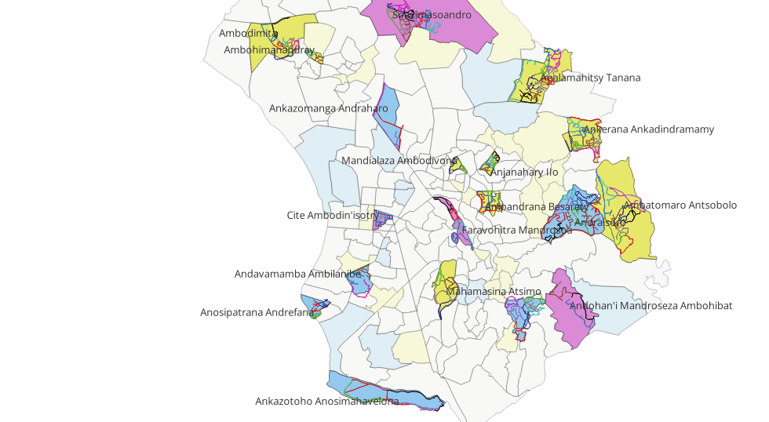

# Background
Antananarivo has a large visible population of street dogs, comprising both owned dogs that are allowed to roam freely and truly stray dogs. This situation poses multiple public health and safety risks, one of the most significant being rabies. Although several rabies cases are officially reported each year, the true burden is likely much higher due to the largely passive nature of the surveillance system.

As part of the CORAMAD project—funded by the French Embassy and implemented by CIRAD and IPM between 2022 and 2024—several activities were undertaken to strengthen rabies surveillance. These included efforts to estimate both the owned and unowned dog populations in the city, providing essential data for planning vaccination campaigns and other control interventions.

# Some remarks towards the specificities of the context
Antananarivo’s urban texture is highly distinctive. It is dominated by extremely narrow alleys, typically 1 to 2 meters wide. In contrast, though less common, the city also features large open spaces such as rice fields and vast main roads. Our previous work (household survey carried out in frame of the same project) has indicated that presence of dogs (be it owned dogs or stray dogs) is linked to socioeconomic status of the neighbourhood. Although this link is not always straightforward, we felt the need to take it into account in our study design and data analysis.
Furthermore, it should be noted that street dogs are typically concentrated around waste bins (every visitor to Antananarivo can see that). As described later, we integrated this aspect into our methodology, calling the waste bins diplomatically as PCC (point de concentration de chien). 

# The overall objective
is to estimate the total population of streetdogs in Tana, as well as detection of factors contributing to "dogspots", if they exist. That is to say, if there is a factor that predisposes the place for a high dog density. 

# Methodology 

## Data collection approaches and tools

Initially proposed method (Abandoned):
To estimate the number of dogs in public spaces, we initially planned to use a fixed-point counting method based on collars as identification marks. Collars were to be assigned to two categories: (i) owned dogs, marked with one color, and (ii) stray dogs, captured as part of a sterilization/vaccination campaign also conducted within the project, marked with a different color. Although this approach was launched on both fronts, it was quickly abandoned due to the rapid disappearance of collars, despite extensive awareness efforts. As a result, we adopted a variation of transect (band/strip) counting method, even though this technique is not ideally suited to dense urban environments.
For simplicity—and with full awareness that counts should ideally be corrected based on dog distance from the observer—in the following text, we use the term "transect" to describe any path or strip along which counting was conducted, regardless of the actual width of the observable area. In most cases, surveyors could not see beyond 10 meters. However, in certain exceptional settings —such as when crossing rice fields— visibility extended up to 100 meters. It is also important to note that "transect" in this context does not refer to a straight line, which would not be feasible in Antananarivo’s environment.

Two independent approaches were undertaken in parallel: 

1) Transect Counts (also band counts)

For the transect surveys, the WVS Data Collection App, developed by Mission Rabies (available at: https://wvs.org.uk/data-collection-app/), was customized in collaboration with its developers to suit the specific needs of the study.

The following features of the application were used:
Creation of user accounts with different roles (coordinator / supervisor / teams 1–10), each with tailored access to data and app functionalities.
Uploading of polygons onto the preloaded map (based on OpenStreetMap), to define each team’s working area.
Real-time tracking of the team’s movements using the “path tracker” feature.
Drawing of transect lines directly on the map.
Assigning specific transect segments to different teams, distinguished by color coding and selective visualization within user accounts.
Monitoring of team movements during transects via the path tracker.
Completion of geolocated questionnaires when one or more dogs were sighted.
Photographing each dog observed, linked to the corresponding questionnaire.
Export of questionnaire data in .csv format.


2) Fixed-Point Counts

After identifying suitable fixed observation points (PCCs)—such as houses with a well-positioned window facing a waste bin—we installed camera traps at six PCCs for a period of five days. The cameras were motion-activated, capturing an image whenever movement was detected. As a result, many photos did not contain dogs. Image quality and visibility varied depending on the landscape, time of day, and camera placement.

## Selection of the geographical sample of Antananarivo

For practical and organizational reasons, we selected the fokontany (the smallest administrative unit in Madagascar) as the sampling unit across the territory of the Antananarivo Urban Municipality (CUA). Fokontany vary considerably in size and structure — some are densely built-up, while others include rice paddies, industrial zones, or inaccessible areas.

CUA is made up of 182 fokontany, of which we targeted 21 (12%). As mentioned earlier, we hypothesized that the spatial distribution of the dog population may be influenced by the socio-economic status of each fokontany. Our stratification was therefore based on vulnerability assessments conducted by the National Office for Disaster and Risk Management (BNGRC), which had previously categorized fokontany by vulnerability level. However, for this study, data were available for only 59 fokontany.
We used a simple algorithm (not described here) to classify these 59 fokontany into three categories ("affluent", "middle-income" and "low-income"). To be noted that this classification is very relativistic and and simplifying the reality, but we still considered it better than no structure. 
Based on this classification, we randomly selected 21 fokontany out of the 59, following these criteria:
Approximately equal representation of “wealthy,” “middle-income,” and “low-income” fokontany within the sample AND balanced representation across the six districts (arrondissements) of the Antananarivo Urban Municipality (CUA) AND whenever possible, avoidance of neighboring fokontany.The initial selection was performed using the “sample” function, and two fokontany were subsequently replaced to meet the additional constraints.


```{r}


```
Map 1 displays all transects covered by the 10 survey teams. Each team’s transects are distinguished by a different color. The fokontany are color-coded according to the following scheme:
Dark yellow = middle-income fokontany, included in the study
Light yellow = middle-income fokontany, not included
Dark purple = high-income (“rich”) fokontany, included
Dark blue = low-income (“poor”) fokontany, included
Light blue = low-income fokontany, not included
Grey = fokontany with unknown socio-economic status


## Practical execution of the transect counts
1) Physical Mapping of Transects
In each selected fokontany, accessible public roads were identified through physical mapping by several surveyors, who recorded their routes using tablet-based GPS. Based on these recorded tracks, between 2 and 10 transects per fokontany —each ranging from 800 meters to 1.8 kilometers in length— were drawn within the WVS application. Each transect was then assigned to one of the 10 participating survey teams.
In large fokontany, all 10 transects were used to ensure full coverage of the area. In smaller fokontany, fewer transects were sufficient. The transects were created with the dual objective of:
Maximizing coverage of all passable roads within the fokontany (complete and uniform coverage), and
Minimizing the chance of counting the same dog twice (by ensuring quick progression and maintaining adequate distance between teams).

2) Dog Counting Procedure
Ten survey teams —each composed of a veterinary student and a hygiene inspector affiliated with the Urban Commune of Antananarivo (CUA)— were trained in the data collection methodology. They were also instructed on how to handle rare instances where two teams might observe the same dog simultaneously: in such cases, the team seeing the dog’s right side was responsible for recording it. Each team was equipped with a tablet and a set of walkie-talkies to facilitate the coordination. Due to the narrowness of most alleyways in Antananarivo, teams were instructed to record all visible dogs, regardless of the distance from the transect line. 
The surveys took place between 6:00 and 7:00 AM, a time chosen to maximize dog sightings under optimal conditions —specifically, when dogs typically roam the streets in search of garbage, which households discard each morning. The 10 teams were coordinated and supervised by two CIRAD staff members. These supervisors ensured that each team was positioned at the start of its transect before initiating a synchronized start of the counts.
In each fokontany, a designated return point was established, where all teams regrouped after completing their transects. It was not possible to coordinate the end time for each transect, so survey durations varied between 20 and 30 minutes depending on the terrain and number of dog sightings.
While walking their transects, teams used the WVS App to record every dog observed. For each sighting, they completed a geolocated questionnaire within the app, including identifying data and, when possible, photographs of both sides of the dog.


# Data and cleaning
All data were downloaded directly from the WVS platform, filtered by project and questionnaire. The raw data structure is similar to that of KoboToolbox or other digital survey platforms, with numerous automatically generated variables typical of mobile data collection. For this section, we focus only on two variables: date and dog count.
Each time surveyors completed a form, a new row was created in the database. This row included all responses to the form's questions: the date, surveyor identifier, number of dogs observed, estimated age and sex of the dog(s), photo(s), and automatically recorded GPS coordinates (including their accuracy).
In practice, some rows show a dog count of zero. This is not an error. It was a deliberate workaround used when several dogs were observed at the same time. In such cases, to record the information quickly, the surveyors would:
First, fill out one form indicating the total number of dogs seen (e.g., 3), and record characteristics for the first dog (with a photo that could include all three animals).
Then, submit additional forms for the remaining dogs, noting their individual characteristics but entering zero in the dog count field.
This was necessary because, in group sightings, the team often had only a brief moment to take a group photo before the dogs disappeared out of sight.
These zeros are not problematic for our analysis. Since we only use aggregated counts per transect per day, all zero-count entries are excluded from final totals, avoiding issues such as zero inflation in modeling.

##Technical Note on Date Formatting
A caveat when downloading data from the WVS (hosted on a UK-based server): if your computer’s primary language or regional setting is English (US), the exported dates may default to US format (MM/DD/YYYY), leading to inconsistencies where month and day values are flipped —sometimes only in part of the dataset. This can create significant issues when importing into R or Excel. It is therefore essential to ensure your system's date format is properly configured before downloading the data.

## Data Cleaning
As a quality control step, all entries reporting more than four dogs in a single form were manually verified using the associated photos. This was possible thanks to the WVS platform, which allows searching for forms by their unique submission code (though the search function is not always precise, it significantly reduces the number of records to check).
In cases where a form listed a high dog count (e.g., 11) but the corresponding photo clearly showed only one dog —and adjacent forms did not indicate any zero entries— the dog count was corrected to 1. These manual corrections were applied directly to the raw Excel spreadsheet exported from the WVS server and occurred in six cases. Most commonly, the error turned out to be due to a double tap of the "1" key. On the other hand we retained three high-count records (around 7 dogs), as the accompanying photos clearly showed multiple animals and the forms were consistent with group sightings.


## Data analysis

We first approach our data with an attempt to use N-mixture model (Royle 2004), via the package unmarked. The model will first be approached from frequentist mindset and subsequently as Bayesian. 

```{r}
library(tidyverse)
library(unmarked) # Core package for fitting hierarchical models
library(AICcmodavg) # Useful for model selection, multimodel inference and GOF evaluation
library(nmixgof) # some specific features of GOF evaluation (rq residuals)

```


# Loading and adapting the data

Fokontany will be an important covariate in the model, but it was not included in the questionnaire (my bad...). So this variable need to be created, but we have all the data necessary to do so. We know which team was working where on which date (and it can be cross-checked, because every dog is geo-referenced). So we can work around it;
```{r}
com <- read.csv("Comptage_chien_errant_-21 fkt copy.csv")
summary(com)
```
```{r}
com <- com %>%
    mutate(
    date = as.Date(`Date.Created`, format = "%d/%m/%Y"),
    fkt = case_when(
      date >= as.Date("2024-06-28") & date <= as.Date("2024-07-04") ~ "Andraisoro",
      date >= as.Date("2024-07-05") & date <= as.Date("2024-07-11") & UserName == "Equipe 1"  ~ "Mandroseza",
      date >= as.Date("2024-07-05") & date <= as.Date("2024-07-11") & UserName == "Equipe2"  ~ "Mandroseza",
      date >= as.Date("2024-07-05") & date <= as.Date("2024-07-11") & UserName == "Equipe3"  ~ "Mandroseza",
      date >= as.Date("2024-07-05") & date <= as.Date("2024-07-11") & UserName == "Equipe4"  ~ "Ambohimiandra",
      date >= as.Date("2024-07-05") & date <= as.Date("2024-07-11") & UserName == "Equipe5"  ~ "Ambohimiandra",
      date >= as.Date("2024-07-05") & date <= as.Date("2024-07-11") & UserName == "Equipe6"  ~ "Ambohimiandra",
      date >= as.Date("2024-07-05") & date <= as.Date("2024-07-11") & UserName == "Equipe7"  ~ "Ambohimiandra",
      date >= as.Date("2024-07-05") & date <= as.Date("2024-07-11") & UserName == "Equipe8"  ~ "Ambohimiandra",
      date >= as.Date("2024-07-05") & date <= as.Date("2024-07-11") & UserName == "Equipe9"  ~ "Ambohimiandra",
      date >= as.Date("2024-07-05") & date <= as.Date("2024-07-11") & UserName == "Equipe10"  ~ "Ambohimiandra",
      date >= as.Date("2024-07-05") & date <= as.Date("2024-07-11") & UserName == "Ambohimiandra"  ~ "Ambohimiandra",
      
      date >= as.Date("2024-07-12") & date <= as.Date("2024-07-18") & UserName == "Equipe2"  ~ "Ambodimita",
      date >= as.Date("2024-07-12") & date <= as.Date("2024-07-18") & UserName == "Equipe3"  ~ "Ambodimita",
      date >= as.Date("2024-07-12") & date <= as.Date("2024-07-18") & UserName == "Equipe4"  ~ "Ambodimita",
      date >= as.Date("2024-07-12") & date <= as.Date("2024-07-18") & UserName == "Equipe5"  ~ "Ambodimita",
      date >= as.Date("2024-07-12") & date <= as.Date("2024-07-18") & UserName == "Equipe6"  ~ "Ambodimita",
      date >= as.Date("2024-07-12") & date <= as.Date("2024-07-18") & UserName == "Equipe7"  ~ "Ambodimita",
      date >= as.Date("2024-07-12") & date <= as.Date("2024-07-18") & UserName == "Equipe8"  ~ "Ambodimita",
      date >= as.Date("2024-07-12") & date <= as.Date("2024-07-18") & UserName == "Equipe9"  ~ "Ambodimita",
      date >= as.Date("2024-07-12") & date <= as.Date("2024-07-18") & UserName == "Equipe 1"  ~ "Ambohimanandray",
      date >= as.Date("2024-07-12") & date <= as.Date("2024-07-18") & UserName == "Equipe10"  ~ "Ambohimanandray",
      
      date >= as.Date("2024-07-19") & date <= as.Date("2024-07-25")  ~ "Analamahitsy",
      
      date >= as.Date("2024-07-26") & date <= as.Date("2024-08-01") & UserName == "Equipe5"  ~ "Andraharo",
      date >= as.Date("2024-07-26") & date <= as.Date("2024-08-01") & UserName == "Equipe7"  ~ "Andraharo",
      date >= as.Date("2024-07-26") & date <= as.Date("2024-08-01") & UserName == "Equipe8"  ~ "Andraharo",
      date >= as.Date("2024-07-26") & date <= as.Date("2024-08-01") & UserName == "Equipe2"  ~ "Ambodivona",
      date >= as.Date("2024-07-26") & date <= as.Date("2024-08-01") & UserName == "Equipe4"  ~ "Ambodivona",
      date >= as.Date("2024-07-26") & date <= as.Date("2024-08-01") & UserName == "Equipe 1"  ~ "Anjanahary",
      date >= as.Date("2024-07-26") & date <= as.Date("2024-08-01") & UserName == "Equipe3"  ~ "Anjanahary",
      date >= as.Date("2024-07-26") & date <= as.Date("2024-08-01") & UserName == "Equipe6"  ~ "Anjanahary",
      date >= as.Date("2024-07-26") & date <= as.Date("2024-08-01") & UserName == "Equipe9"  ~ "Anjanahary",
      date >= as.Date("2024-07-26") & date <= as.Date("2024-08-01") & UserName == "Equipe10"  ~ "Anjanahary",
      
      date >= as.Date("2024-08-02") & date <= as.Date("2024-08-08") & UserName == "Equipe5" ~ "Isotry-Antetezana",
      date >= as.Date("2024-08-02") & date <= as.Date("2024-08-08") & UserName == "Equipe7" ~ "Isotry-Antetezana",
      date >= as.Date("2024-08-02") & date <= as.Date("2024-08-08") & UserName == "Equipe2"  ~ "Faravohitra-Analakely",
      date >= as.Date("2024-08-02") & date <= as.Date("2024-08-08") & UserName == "Equipe3"  ~ "Faravohitra-Analakely",
      date >= as.Date("2024-08-02") & date <= as.Date("2024-08-08") & UserName == "Equipe4"  ~ "Faravohitra-Analakely",
      date >= as.Date("2024-08-02") & date <= as.Date("2024-08-08") & UserName == "Equipe 1"  ~ "Faravohitra-Analakely",
      date >= as.Date("2024-08-02") & date <= as.Date("2024-08-08") & UserName == "Equipe6"  ~ "Mahamasina",
      date >= as.Date("2024-08-02") & date <= as.Date("2024-08-08") & UserName == "Equipe8"  ~ "Mahamasina",
      date >= as.Date("2024-08-02") & date <= as.Date("2024-08-08") & UserName == "Equipe9"  ~ "Mahamasina",
      date >= as.Date("2024-08-02") & date <= as.Date("2024-08-08") & UserName == "Equipe10"  ~ "Mahamasina",
      
      date >= as.Date("2024-08-09") & date <= as.Date("2024-08-16") & UserName == "Equipe6"  ~ "Andavamamba",
      date >= as.Date("2024-08-09") & date <= as.Date("2024-08-16") & UserName == "Equipe5"  ~ "Andavamamba",
      date >= as.Date("2024-08-09") & date <= as.Date("2024-08-16") & UserName == "Equipe7"  ~ "Andavamamba",
      date >= as.Date("2024-08-09") & date <= as.Date("2024-08-16") & UserName == "Equipe4"  ~ "Anosipatrana",
      date >= as.Date("2024-08-09") & date <= as.Date("2024-08-16") & UserName == "Equipe9"  ~ "Anosipatrana",
      date >= as.Date("2024-08-09") & date <= as.Date("2024-08-16") & UserName == "Equipe10"  ~ "Anosipatrana",
      date >= as.Date("2024-08-09") & date <= as.Date("2024-08-16") & UserName == "Equipe 1"  ~ "Ankazatoho",
      date >= as.Date("2024-08-09") & date <= as.Date("2024-08-16") & UserName == "Equipe2"  ~ "Ankazatoho",
      date >= as.Date("2024-08-09") & date <= as.Date("2024-08-16") & UserName == "Equipe3"  ~ "Ankazatoho",
      date >= as.Date("2024-08-09") & date <= as.Date("2024-08-16") & UserName == "Equipe8"  ~ "Ankazatoho",

      date >= as.Date("2024-08-19") & date <= as.Date("2024-08-23")  ~ "Ankerana",
      
      date >= as.Date("2024-08-26") & date <= as.Date("2024-08-30")  ~ "Soavimasoandro",
      
      date >= as.Date("2024-10-10") & date <= as.Date("2024-10-16") ~ "Ampandrana",
      date >= as.Date("2024-10-17") & date <= as.Date("2024-10-31") ~ "Ambatomaro",
                  TRUE ~ NA
    )
  )
View(com)
```

Well, that was a bit tedious, but it seems that it worked. Just some additional checkups that we got everything alright; 
```{r}
#check if all fkt exist
unique(com$fkt)

#check if all days have been asigned to a fkt
com %>% filter(is.na(fkt)) %>% distinct(date)
```
This looks alright, we have 19 distinct names of fokontany (or 21, because two small ones are merged).
We then have 2 records where fokontany is NA which is unlikely to change the great scheme of things. 

## A little exploration of the counts we have 

```{r}
#getting rid of all the noise
com_clean <- com %>% 
  mutate (n = nombre.de.chien) %>%
  select(date, n, fkt) %>% 
  filter(!is.na(fkt))

#sum per day per fkt
sumfktday <-com_clean %>%
  group_by(date, fkt) %>%
  summarise(sum_fkt = sum(n, na.rm = TRUE))

print(sumfktday, n=200)

#a table of basic summarizing characteristics
summary_fkt <-sumfktday %>%
  group_by(fkt) %>%
  summarise(minfkt= min(sum_fkt),
            maxfkt= max(sum_fkt),
            meanfkt = mean(sum_fkt),
            varfkt = var(sum_fkt) 
            ) %>%
  mutate(id = c(1:19))

print(summary_fkt, n=20)

png("boxplot counts per fkt.png", width = 800, height = 600)
boxplot(sum_fkt ~ fkt, data = sumfktday, las = 2, cex.axis = 0.5)

write.csv(summary_fkt, "summary_fkt")
```

This last table indicates that there are very large differences between the fokontany. This is not surprising, given the differences in their area, the length of transects and their urban fabric. Moreover, count data are overdispersed (var > mean, at least in some cases), which will become important later. 

# Arranging data and metadata

Unmarked uses a custom data structure (S4 class object) called unmarkedFrame to store all data and metadata. 
UnmarkedFrame contains “slots” ; one slot for an observation matrix y, one slot for site-level covariates and one slot for observation-level covariates
• y (Observation Matrix):
    ◦ This is the only required slot. It's a matrix where each row corresponds to a unique sampling site, and columns represent the repeated surveys or sampling occasions at those sites. So in an m*j matrix, M corresponds to the number of sites (rows) and J is the maximum number of obervations or sampling periods per site (columns). If one site is sampled less times than another, missing valus should be coded as NA (the function can handle this).
• siteCovs (Site-Level Covariates):
    ◦ This is a data.frame where each row corresponds to a sampling site, and each column represents a site-specific characteristic (e.g., elevation, habitat type) that does not change across repeated visits to that site. It must have the same number or rows (M) as the matrix. If a site-level covariate is NA, unmarked will automaticlaly remove all data for that site prior to fitting the model. 
    ◦ These covariates are typically used to explain variation in the underlying abundance or occurrence process 
• obsCovs (Observation-Level Covariates):
    ◦ This is a data.frame where each row corresponds to a particular observation (i.e., a specific site on a specific occasion) and each column represents a characteristic that varies across the repeated surveys at a site (e.g., survey date, duration, weather).
    The covariates should be organised in site-major order (site1-day1, site1-day2.... site2-day1...)
    ◦ These covariates are primarily used to explain variation in the detection probability. They can vary acros observations / repeated visits. 

To obtaine the unmarkedFrame, we need to transform our data in several ways. 
## First create the observation matrix: 

```{r}
# introducing variable repetition, which will indicate the rank of passage within each fokontany
sumfktday <- as.data.frame(sumfktday)
sfd_ranks <- sumfktday %>%
  group_by(fkt) %>%
  arrange(fkt, date) %>%
  mutate(repetition = row_number())

print(sfd_ranks)

#transforming into wide table
sfd_counts <- sfd_ranks %>%
  select(fkt, sum_fkt, repetition) %>%
  pivot_wider(
    names_from = repetition,
    values_from = sum_fkt)

print(sfd_counts)

# creating the matrix of counts 
obs_matrix <- sfd_counts %>%
  ungroup() %>% #(if we dont ungroup, the fkt will always appear in the matrix even after select)
  select(- fkt) %>%
  as.matrix()
  
print(obs_matrix)

```
Looks as we wanted it! I will save it for later, because we might need it in the bayesian approach. 
```{r}
write.csv(obs_matrix, file = "obs_matrix.csv")

```


## Load the dataframe of site covariates
this has been elaborated in Excel using the data from QGIS (creating a buffer zone around all transects to calculate the area covered by the counting).WVS allovs the extraction of "paths" in the kml format, which can then be handled in QGIS. 
The site covariates under consideration will be "Seclasse" (=socioeconomic class; affluent, middle-income, low-income), "area" (total surface covered), "length" (the sum of all transect lengths per fokontany) and "bac" (number of waste bins present in the fokontany, as mapped by our surveyors). To note that area and length are collinear, so should not be used in the same model. 
```{r}
siteCovs <- read_csv("Site covariates 21 fkt.csv") %>%
  mutate(
    area = `Real area covered`, 
    bac = `PPC Bac ou point d'ordures`
  )
```

## Load observation covariates
Observation covariates are supposed to be those that could influence the dog visibility from one day to another. So it is a long table where each row corresponds to one site-observation combination (date-fokontany in our case). In our specific case, the observability of dogs was unlikely to change from one day to another, as all observations were performed in the winter phase, when weather tends to be stable (no sudden rains or such things). The counting was done every day at constant hours, and gradually shifted backwards because the goal was to start counting at the dusk. However, it is possible that the real visibility of dogs is influenced by the urban fabric. Also, the increasing experience of surveyors over the time could have played a role. That is why we include date (numerical) and fkt (categoric) as observation covariates. Again, they are interrelated (each fokontany was counted in specific dates), so probably should not stand together in the same model.  
Now if we had same number of repetition per fokontany, constructing the obsCov frame would have been relatively straightforward. But as we experimented and repeated Ambatomaro 9 times, while other fokontany only 5 times (and N-mixture model can handle that), it becomes quite complicated, because the algorithm wants ObsCovs to have the same number of rows as the count matrix has cells, including NA cells. So we can't just use previously created sfdranks, we need to add a row for the non-effectuated repetitions (6-9) in every fokontany except Ambatomaro. 

Some authors simplify this part, assuming that detection probability is constant across observers, if those are well trained and the methodology is sufficiently stable. 

```{r}

# Create the extra empty rows
addNA <- data.frame(
  date = NA,
  sum_fkt = NA,
  fkt = rep(c(
  "Ambodimita", "Ambohimanandray", "Ambohimiandra",
  "Ampandrana", "Analamahitsy", "Andavamamba", "Andraharo",
  "Ambodivona", "Andraisoro", "Anjanahary", "Ankazatoho",
  "Ankerana", "Anosipatrana", "Faravohitra-Analakely", 
  "Isotry-Antetezana", "Mahamasina", "Mandroseza", "Soavimasoandro"), each = 4),
  repetition = rep(6:9, times = 18))

obsCovs <- rbind (sfd_ranks, addNA) %>% 
  mutate(
    siteNo = case_when(
      fkt == "Ambatomaro" ~ 1,
      fkt == "Ambodimita" ~ 2,
      fkt == "Ambodivona" ~ 3,
      fkt == "Ambohimanandray" ~ 4, 
      fkt == "Ambohimiandra" ~ 5,
      fkt == "Ampandrana" ~ 6, 
      fkt == "Analamahitsy" ~ 7, 
      fkt == "Andavamamba" ~ 8, 
      fkt == "Andraharo" ~ 9,
      fkt == "Andraisoro" ~ 10,
      fkt == "Anjanahary" ~ 11, 
      fkt == "Ankazatoho" ~ 12, 
      fkt == "Ankerana" ~ 13, 
      fkt == "Anosipatrana" ~ 14, 
      fkt == "Faravohitra-Analakely" ~ 15, 
      fkt == "Isotry-Antetezana" ~ 16, 
      fkt == "Mahamasina" ~ 17, 
      fkt == "Mandroseza" ~ 18, 
      fkt == "Soavimasoandro" ~ 19),
    date = as.numeric(date)) %>%
  rename(
    fktObs = fkt) %>%   # I also have to rename the variable because if it is the same in ObsCovs and SiteCovs it gives a warning
  arrange(siteNo)

```
Looks good if you print it, because is has 171 rows, which corresponds to the count matrix (9x19). 

Then we determine a maximum abundance (K) for the `pcount` model.
This should be set sufficiently high to not truncate the latent abundance distribution.
```{r}
K_for_model <- max(sfd_ranks$sum_fkt) + 100 # Adding a buffer
```

And finally we construct the unmarkedFrame 
```{r}
umf <- unmarkedFramePCount(
  y = obs_matrix,
  siteCovs = siteCovs,
  obsCovs = obsCovs
)

summary(umf)
```


# Fit several different N-mixture models with various covariate combinations and random effects.

Recall the N-mixture model (Royle, 2004)
-	hierarchical model used to estimate true population abundance while accounting for imperfect detection
-	separates the true but unknown abundance (latent abundance with Poisson or other distributions) from the (imperfect) observation process by modelling both
- controls for variation in ecological conditions among sites and across time
- although initially developped for point data, it is used and works well with data collected along transects (Gilbert et al., 2024)
 
While all within-site variation is considered observation error and all between-site variation stems from the underlying abundance process, in practice heterogeneous observation error and movement of animals can lead to detection-driven variation between sites and abundance-driven variation within sites. The model consists of two main processes:
• Abundance Process (or state): This describes the true number of individuals (N) at each site (strip / band transect in our case, summarized to the fokontany level). It accounts for the spatial variation in abundance among sites. Common distributions for the abundance process include Poisson (the default in unmarked), Zero-inflated Poisson (ZIP), and Negative Binomial (NB). NB models were found to be better performing with overdispersed data (eg. Kowalik et al. 2019)
• Detection Process: This describes the probability of detecting an individual (p) that is present at a site during a survey. It accounts for imperfect detection. The Binomial distribution is commonly used for the detection process.

Assumptions: 
1. Closure: Each site is assumed to be occupied by a fixed number of individuals across all replicate surveys. Although this is not 100% true in our case (dogs ould immigrate from the neighbouring fokontany overnight), we decide to neglect this. In any case, the very short time intervals between the sightings make it highly unlikely for births and deaths to occur. There is also an adapted algorithm for open populations, we will use that one later. 
(There is an adaptation for open populations, but this does not really apply to our situation; it applies to a design where animals are counted repeatedly over several seasons / secondary periods, which allow for immigration, natality, mortality etc.)
2. No unmodeled heterogeneity in detection probability: Variation among sites in detection probability can be explained by detection covariates. 
3. No false positives: If present, individuals might be missed due to imperfect detection. But if absent, they will not be erroneously counted as present. 
4. Other: Data are conditionally independent given covariates and site latent variables N; specification of covariate relationships and between-site and within-site distributions is correct.
5. All individuals recorded at a given site-time combination have the same detection probability

N-mixture models in unmarked retain many of the principles and functionalities of linear regression (package lme4 for example). Thus we can random effects in site covariates, if we deem pertinent. 
K is a crucial parameter when fitting the model. It is an upper bound which approximates the maximum possible aubdance at a given site. The choice of K can influence the estimation of abundance. If K is too low, it can lead to underestimation of abundance. It's recommended to test successively increasing values of K until the parameter estimates stabilize. Another method is to use an automatic way to choose K by ensuring that the Poisson upper tail probability is below a certain threshold (e.g., 10^-10)

N-mixture models are not that robust as lm models and can sometimes produce unrealistically large, or even infinite, estimates of abundance, especially when detection probability is low or the number of sampling occasions is small or if there is some unmodeled heterogeneity (Dennis et al., 2014). 
In our case, given the huge differences between our observation sites, it would make no sense to start with the simplest model (no site covariates). This would make the model assume that all sites share the same mean abundance and same detection probability, which is impossible in our case. So including either area or length is obligatory. On the other hand, the observation probability could have remain constant throughout the sightings, given the good training of the surveyors, stable weather and overall homogeneous conditions.  
It is preferable to try out several models which seem biologically plausible  and then compare their AICs and GOFs. 
There is no automated process in the package which would allow an automated selection of covariates, the data analyzer has to do it. And maybe it is for the good.

We try out several models, each one along with some preliminary result visualisation, residuals plot and convergence statistics. The models producing apriori spurious numbers will not be taken into account.  

The numbers in the cells indicate the model that combines the given coavariates. 

Site covariates (including RE)    Observation covariates
-------------------------------------------------------------
                                    date    fkt     1 (intercept only)
Length                            | 1    |  2   | 3    |
--------------------------------------------------------------
Length + Seclasse                 | 4    |  5   | 6    |  
--------------------------------------------------------------
Length + bac                      | 7    |  8   | 9    |  
--------------------------------------------------------------
Length + 1|fkt                    | 10   |  11  | 12   |  
--------------------------------------------------------------
Length + Seclasse + bac           | 13   |  14  | 15   |  
--------------------------------------------------------------
Length + Seclasse + 1|fkt         | 16   |  17  | 18   |  
--------------------------------------------------------------
Length + bac + 1|fkt              | 19   |  20  | 21   |  
--------------------------------------------------------------
Length + Seclasse + bac + 1|fkt   | 22   |  23  | 24   |  
--------------------------------------------------------------
Length + 1|Seclasse               | 25   |  26  | 27   |
--------------------------------------------------------------
Length + bac + 1|Seclasse         | 28   |  29  | 30   |
Area
Area + Seclasse
Area + bac
Area + 1|fkt
Area + Seclasse + bac
Area + Seclasse + 1|fkt
Area + bac + 1|fkt
Area + Seclasse + bac + 1|fkt

This being established, we shall keep in mind several caveats reported with N-mixture models; 
- maximum parsimony is not always a good measure of the predictive accuracy ()
- the models can be substantially biased by even small amounts of unmodelled heterogeneity (Duarte et al., 2018), or when detection probabilities and number of sampling occasions are low (Denes et al. 2015), or when covariates in abundance and detection are the same or highly correlated with the sites or sampling frequency (Yamaura et al., 2013)

I erased all the models which turned out instable (very large SE or no SE produced)


### Model 12b; allowing random intercept and slope for length ; MAYBE? 

```{r}
fm12b <- pcount(
  ~ 1 ~ length + (length||fkt),
  umf,
  K = 400,
  mixture = "NB")

plot(fitted(fm12b), residuals(fm12b), main = "Residuals Plot for Model 12b", xlab = "fitted", ylab = "residuals")
covDiag(fm12b)
checkParms(fm12b)
checkConv(fm12b)

summary(fm12b)
predict(fm12b, type = "state")


```


### Model 19; MAYBE

- although residuals are all over the place


```{r}
fm19 <- pcount(
  ~ date ~ length + bac + (1|fkt),
  umf,
  K = 400,
  mixture = "NB")

plot(fitted(fm19), residuals(fm19), main = "Residuals Plot for Model 19", xlab = "fitted", ylab = "residuals")
checkParms(fm19)
checkConv(fm19)

summary(fm19)
predict(fm19, type = "state")


```


### Model 24 ; MAYBE? 

- resonable estimates with reasonable SE


```{r}
fm24 <- pcount(
  ~ 1 ~ Seclasse + length + bac + (1|fkt),
  umf,
  K = 400,
  mixture = "NB")

plot(fitted(fm24), residuals(fm24), main = "Residuals Plot for Model 24", xlab = "fitted", ylab = "residuals")
covDiag(fm24)
checkParms(fm24)
checkConv(fm24)

summary(fm24)
predict(fm24, type = "state")

```


### Model 27 ; MAYBE? 

- resonable estimates with reasonable SE


```{r}
fm27 <- pcount(
  ~ 1 ~ length + (1|Seclasse),
  umf,
  K = 400,
  mixture = "NB")

plot(fitted(fm27), residuals(fm27), main = "Residuals Plot for Model 27", xlab = "fitted", ylab = "residuals")
covDiag(fm27)
checkParms(fm27)
checkConv(fm27)

summary(fm27)
predict(fm27, type = "state")

```


## Conclusion and comparison of 60 models

- there are four models using "length" as siteCov, which does not produce spurious values and produce SE; all of them include either fkt or Seclasse as random effects (makes sense). Some of them are nested. Only model 19 uses ObsCov, the others are intercept-only when regarding the detection probability.
- no model using "area" as siteCov produced Se (why? its a number as length...), although several models produced biologically plausible values.

Comparing models using length as covariate
- based on the comments made to every model, we retain 12,19,24, 27 and 48 for a comparison. Model 48 did not produce SE, but we will include it just to have one example of area-using model.  
- note that N-mixture models are known to produce spurious results and AIC is not the best criterion of selection. This is because the AIC is unable to discriminate among models that use different components of the detection error and abundance estimators. Several authors state this and for example Joseph et al, (2009) decided to put first some (expert-advised) treshold criteria of "ecological realism" and select (based on AIC) only from models which do not trepass these criteria. 

```{r}
modSel(fitList("fm12" = fm12, "fm12b" = fm12b, "fm19" = fm19, "fm24" = fm24,"fm27" = fm27, "fm48" = fm48 ))

```

Multi-model inference from the top two models (having less than 2 delta AIC between them)
- averages the results over several models, weighting the different models as per their AIC
```{r}

candidates_avg1 <- list(fm12, fm12b, fm27)
newdata_frame_avg1 <- data.frame(
  fkt = siteCovs$fkt,
  length = siteCovs$length,
  bac = siteCovs$bac,
  Seclasse = siteCovs$Seclasse)

prediction_mod_fkt <- modavgPred(cand.set = candidates_avg1, modnames = NULL, newdata_frame_avg1, parm.type = "lambda", type = "response")

print(prediction_mod_fkt)
```

```{r}

prediction_mod_fkt_df <- prediction_mod_fkt %>% as.data.frame () %>% mutate (id = c(1:19))

visu_prediction_mod_fkt <- merge(summary_fkt, prediction_mod_fkt_df,by = "id")

print(visu_prediction_mod_fkt)
```

```{r}
print(sum(prediction_mod_fkt$mod.avg.pred))
print(sum(prediction_mod_fkt$lower.CL, na.rm = TRUE) + 96)
print(sum(prediction_mod_fkt$upper.CL, na.rm = TRUE) + 96) #I know, i know, but i just need a rough estimate, ok? 

predict(fm12, type = "det")
predict(fm12b, type = "det")
predict(fm27, type = "det")
```


# GOF evaluation

## Parametric Bootstrapping
Parametric bootstrapping assesses overall model fit by comparing a fit-statistic (in our case chi2) between the observed data and data simulated from the fitted model. To be meaningful`nsim` (number of simulations) should be e.g., 1000 or 5000. 
The algorithm can easily run several hours before converging 1000 sims, so its good to have something else planned in between. 

Reading the output:
observed stat = calculated from our sample
p-value = proportion of bootstrap statistics greater than or equal to the observed; if lower than 0.05 = poor fit (the observed statistic is unusually large compared to the simulations)

quantiles = shows the spread of statistics from the bootstrap replicates. the observed value ideally should not be extreme (not less then 25 or more than 75 percentile)

c-hat = overdispersion parameter (ratio of observed to mean expected statistics)
close to 1 ~ good fit
larger than 1 ~ oversdispersion (but acceptable up to 4)
smaller than 1 ~ underdispersion


```{r}
Nmix.gof.test(fm12, nsim = 1000)
```

```{r}
Nmix.gof.test(fm18, nsim = 1000)
```

## Randomized-quantile residuals (Knape et al., 2018)

- they should have standard normal distribution if the model is correct
Marginal rq residuals: These are computed from the marginal distribution of the counts, effectively summing over all possible latent abundances. For instance, if the abundance is modeled with ZIP, the marginal distribution of each observation is also a ZIP. Residuals from the same site are not independent and should not be used directly in standard QQ plots that assume independence. Instead, separate QQ plots for each visit or plots against specific covariates are recommended.

Site-sum rq residuals: These are derived from the marginal distribution of the sum of counts within each site. This aggregation helps to create independent residuals per site, making them suitable for plots against site-specific covariates.

Observation rq residuals: These residuals focus on the detection part of the model by conditioning only on the observed abundances, using a random sample from the empirical Bayes distribution of abundances. This type of residual is specifically useful for checking the fit of the detection process.


```{r}
marginal_residuals_fm12 <- nmixgof::rqresiduals(fm12, type = "marginal")
sitesum_residuals_fm12 <- nmixgof::rqresiduals(fm12, type = "site-sum")
observation_residuals_fm12 <- nmixgof::rqresiduals(fm12, type = "observation") #this is just for the record, this model did not include observation covariates

#plotting marginal residual for the first visit
qqnorm(marginal_residuals_fm12[, 1], main = "QQ Plot of Marginal RQ Residuals (First Visit)")
qqline(marginal_residuals_fm12[, 1])

#plotting sitesum residuals
qqnorm(sitesum_residuals_fm12, main = "QQ Plot of Site-Sum RQ Residuals")
qqline(sitesum_residuals_fm12)

plot(umf@siteCovs$length, sitesum_residuals_fm12,
      xlab = "Length (Site Covariate)", ylab = "Site-Sum RQ Residuals",
      main = "Site-Sum Residuals vs. Length")

```

### Quadratic Conditional Variance (Duarte 2022)
- another N-mixture specific GOF measure
- the average squared difference between observed counts and model-predicted counts ; analogous to the mean squared error (MSE) in standard regression, but adapted for hierarchical count models.
- lower is better, among models

```{r}
# Predicted means for each observation (site x visit)
lambda_hat_fm12 <- predict(fm12, type = "state")$Predicted

# Predicted detection for each site x visit
p_hat_fm12 <- predict(fm12, type = "det")$Predicted

# Expected counts for each site x visit
mu_hat_fm12 <- lambda_hat_fm12 * p_hat_fm12

# QCV formula: mean((observed - predicted)^2)
qcv_value_fm12 <- mean((obs_matrix - mu_hat_fm12)^2, na.rm = TRUE)
print(qcv_value_fm12)


#Function for other models
qcv <- function(model, obs_counts) {
  lambda_hat <- predict(model, type = "state")$Predicted
  p_hat <- predict(model, type = "det")$Predicted
  mu_hat <- lambda_hat * p_hat
  qcv <- mean((obs_counts - mu_hat)^2, na.rm = TRUE)
  return(qcv)
}

qcvs <- sapply(list("fm1" = fm1, "fm12" = fm12, "fm12b" = fm12b, "fm27" = fm27), qcv, obs_counts = obs_matrix)
print(qcvs)
```

By this metrics, fm12b seems the winner, while fm1 is the worst (expected, according to spurious data it produced). 
We could theoretically run this across the models and use it instead of AIC? 


Some preliminary reflection: 


The SE remains still very high in majority of fokontany, but this is probably due to the data. Interestingly, the fokontany with 9 sightings (Ambatomaro ; number 1) has SE very close to the another fkt of comparable size and urban structure with 5 sightings (Soavimasoandro, number 19). 
This makes us question how many freaking times we would have to repeat the transects to stabilize the counts...

Given that we counted approximately 1/7 of the area of CUA, a rough estimate would be 16000 dogs in total. 


""""""""""""""""""""##################################""""""""""""""""""""""""""""""""##############################""

NOW WHAT IF.....

we considered transect as site and fokontany as random effect? 

advantages: 
- it adheres a bit more to the logic of hierarchical models; we use fine-scale information (we might capture more accurately the variation in detection, which can vary largely between transects in one fokontany)
- the variability between transects is purportedly smaller than between fokontany, so it might sort out the problem of some sites being overdispersed and others not
- we might do it with Poisson instead of NB....;

disadvantages: 
- more computationally demanding
- output less straightforward (number per transect is not as speaking as number per fokontany, but can be sumed up)
- site covariates are not disaggregated at transect level
- I cannot think of another disadvantage

LETS DO IT

```{r}
#getting rid of all the noise and arranging so that umf can be prepared
com_clean_transect <- com %>% 
  mutate (
    n = nombre.de.chien,
    transect = paste(fkt, UserName), 
    date = as.Date(date, format = "%d/%m/%Y")) %>%
  select(date, n, fkt, transect) %>% 
  arrange(date, transect) %>%
  filter(!is.na(fkt)) 

head(com_clean_transect)
unique(com_clean_transect$transect)


#there are still some little bugs (=3 dogs, we will just remove this)
com_clean_transect <- com_clean_transect %>%
  filter(!transect %in% c("Ambohimiandra Ambohimiandra", "Andraisoro Andraisoro")) 


#sum per day per transect
sum_transect_day <-com_clean_transect %>%
  group_by(fkt, transect, date) %>%
  summarise(sum_transect = sum(n, na.rm = TRUE))

print(sum_transect_day)

#basic summarizing characteristics per transect
sum_transect_day_summary <- sum_transect_day %>%
  group_by(transect) %>%
  summarise(
    mean_transect = mean(sum_transect, na.rm = TRUE),
    max_transect = max(sum_transect, na.rm = TRUE),
    min_transect = min(sum_transect, na.rm = TRUE),
    variance_transect = var(sum_transect, na.rm = TRUE)
  )

print(sum_transect_day_summary)
print(sum(sum_transect_day_summary$mean_transect))
print(max(sum_transect_day_summary$mean_transect)) #to approximate K
```


Creating of new observation matrix per transect
```{r}

sum_transect_day_ranked <- sum_transect_day %>%
  group_by(transect) %>%
  mutate(repetition = row_number()) %>%
  ungroup()

print(sum_transect_day_ranked)

obs_matrix_transect <- sum_transect_day_ranked %>%
  select(transect, repetition, sum_transect) %>%
  pivot_wider(
    names_from = repetition,
    values_from = sum_transect) %>%
  ungroup() %>% 
  select(- transect) %>%
  as.matrix()
 
print(obs_matrix_transect)

```

Sitecovs


```{r}
transect_length <- read.csv("Length transects.csv") # created in QGIS

siteCovs_transect_prep <- sum_transect_day %>%
  mutate(
    seclasse = case_when(          # create groups based on first_word
      fkt %in% c("Soavimasoandro", "Ambatomaro", "Faravohitra-Analakely", "Isotry-Antetezana", "Mandroseza" ) ~ "Riche",
      fkt %in% c("Ambodimita", "Ambodivona", "Ambohimanandray", "Ampandrana", "Analamahitsy", "Anjanahary", "Ankerana", "Mahamasina") ~ "Moyen",
      TRUE ~ "Pauvre")) %>%
  select(transect, fkt, seclasse) %>%
  distinct ()

siteCovs_transect <- merge(siteCovs_transect_prep, transect_length, by = "transect")
    
print(siteCovs_transect)

```


Obscovs

```{r}
transect_names <- unique(sum_transect_day_ranked$transect)

addNAtransects <- data.frame(
  transect = rep(transect_names, each = 4),
  repetition = rep(6:9, times = length(transect_names))) %>% 
  mutate(fkt = word(transect, 1)) %>%
  filter(fkt !="Ambatomaro")
             
print(addNAtransects)

obsCovs_transect <- bind_rows(sum_transect_day_ranked, addNAtransects) %>% arrange (transect, repetition)

print(obsCovs_transect)

```


```{r}
umf_t <- unmarkedFramePCount(
  y = obs_matrix_transect,
  siteCovs = siteCovs_transect,
  obsCovs = obsCovs_transect
)

summary(umf_t)
```

##Models using transect as site
- since the transects are many, the output is less intuitive to read. So as a "criterion of plausibility" i use the rule of thumb that the sum of the predictions per transect shall not be more than 3x sum of transects means (calculated from the real data). This is based on (my own) expert opinion; I am strongly convinced that we have counted majority of the dogs out there. The prediction thus shall not be more than three times higher than the real counts. This will be furhter reflected in the parameter K (the maximum expectation per transect), this will be set as the 2x the maximum dogs ever counted over 102 transects. 


### Model t3 ; MAYBE

```{r}
fmt3 <- pcount(
  ~ 1 ~ length, 
  umf_t,
  K = 60,
  mixture = "NB")

plot(fitted(fmt3), residuals(fmt3), main = "Residuals Plot for Model t3", xlab = "fitted", ylab = "residuals")
covDiag(fmt3)
checkParms(fmt3)
checkConv(fmt3)

prediction_fmt3 <- predict(fmt3, type = "state")
print(prediction_fmt3)
sum(prediction_fmt3$Predicted)
```
```{r}
prediction_fmt3 <- predict(fmt3, type = "state")
sum(prediction_fmt3$Predicted)
sum(prediction_fmt3$lower)
sum(prediction_fmt3$upper)
predict(fmt3, type = "det")
```


### Model t11; MAYBE

```{r}
fmt11 <- pcount(
  ~ seclasse ~ length, 
  umf_t,
  K = 60,
  mixture = "NB")

plot(fitted(fmt11), residuals(fmt11), main = "Residuals Plot for Model t11", xlab = "fitted", ylab = "residuals")
covDiag(fmt11)
checkParms(fmt11)
checkConv(fmt11)

prediction_fmt11 <- predict(fmt11, type = "state")
print(prediction_fmt11)
sum(prediction_fmt11$Predicted)
```


```{r}
modSel(fitList("fmt3" = fmt3, "fmt11" = fmt11, "fmt12" = fmt12))

```

Multi-model inference from the top two models 
- the differences of AIC are huge so probable this should not be done...
```{r}

candidates_avg2 <- list(fmt3, fmt11, fmt12)
newdata_frame_avg2 <- data.frame(
  fkt = siteCovs_transect$fkt,
  length = siteCovs_transect$length,
  Seclasse = siteCovs_transect$seclasse)

prediction_mod_transect <- modavgPred(cand.set = candidates_avg2, modnames = NULL, newdata_frame_avg2, parm.type = "lambda", type = "response")

print(prediction_mod_fkt)
```
I dont really know what happened there, but lets bootstrap the best model. 


```{r}
Nmix.gof.test(fmt12, nsim = 1000)
```


# Exploring alternatives
I take the two best models taking fokontany as site and alternate some parameters in them

## Trying out Poisson distribution for abundance
- SE not produced

```{r}
fm12_Pois <- pcount(
  ~ 1 ~ length + (1|fkt),
  umf,
  K = 400,
  mixture = "P")

plot(fitted(fm12_Pois), residuals(fm12_Pois), main = "Residuals Plot for Model 12_Pois", xlab = "fitted", ylab = "residuals")
covDiag(fm12_Pois)
checkParms(fm12_Pois)
checkConv(fm12_Pois)

summary(fm12_Pois)
predict(fm12_Pois, type = "state")
```


## Examining the sensitivity to different values of K
```{r}
fm12_K300 <- pcount(
  ~ 1 ~ length + (1|fkt),
  umf,
  K = 300,
  mixture = "NB")

covDiag(fm12_K300)
checkParms(fm12_K300)
checkConv(fm12_K300)

summary(fm12_K300)
predict(fm12_K300, type = "state")
```


```{r}
fm12_K250 <- pcount(
  ~ 1 ~ length + (1|fkt),
  umf,
  K = 250,
  mixture = "NB")

covDiag(fm12_K250)
checkParms(fm12_K250)
checkConv(fm12_K250)

summary(fm12_K250)
predict(fm12_K250, type = "state")
```

```{r}
fm12_K201 <- pcount(
  ~ 1 ~ length + (1|fkt),
  umf,
  K = 201,
  mixture = "NB")

covDiag(fm12_K201)
checkParms(fm12_K201)
checkConv(fm12_K201)

summary(fm12_K201)
predict(fm12_K201, type = "state")
```


## Trying out density as outcome, instead of counts
The model is build to deal with raw counts, but it can handle dog density by using offsets. 
Because the aren't all the same size, we tell the model, what is the baseline expected number of dogs per area unit.
The so called offset(log(Area_sqm)) term acts as a scaling factor, allowing the model to figure out the density instead of just the total number of dogs for each site. We include the natural logarithm of your site area as an offset in the abundance part of the formula. This works because the abundance parameter (lambda) is already on a log-scale.

### Model fm12_density ; NO
- nonsensical numbers
- cannot be done with fkt as random effect (tried, god error)

```{r}

fm12_density <- pcount(
  ~ 1 ~ length + offset(log(area)), 
  umf,
  K = 1000
)

summary(fm12_density)
predict(fm12_density, type = "state")
covDiag(fm12_density)
checkParms(fm12_density)
checkConv(fm12_density)

```


